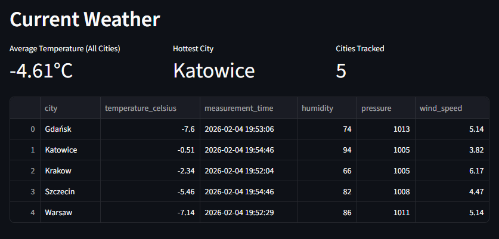
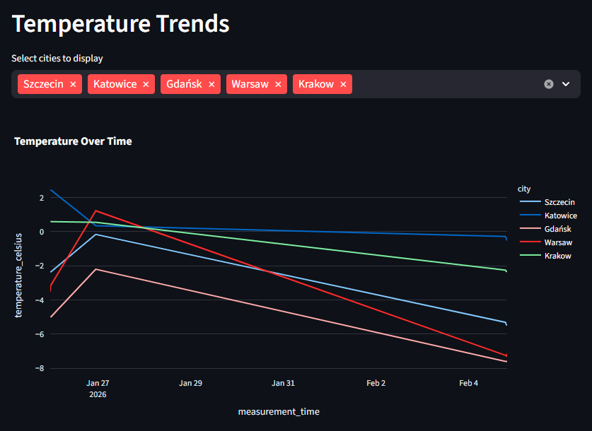
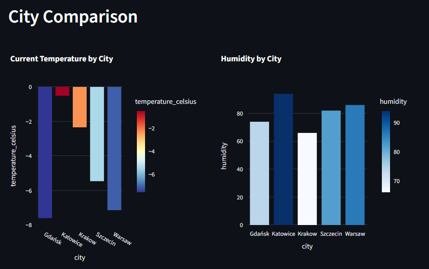

# Weather Data Pipeline

ETL pipeline for fetching and processing weather data from OpenWeatherMap API.

[](https://www.python.org/)
[](https://www.postgresql.org/)
[](https://www.docker.com/)
[](tests/)

---

## Features

**Data Pipeline:**
- Fetches real-time weather data from OpenWeatherMap API
- Transforms data (Kelvin to Celsius, Unix timestamps to datetime)
- PostgreSQL storage with composite primary keys for duplicate prevention
- Production-quality logging and comprehensive error handling

**Orchestration (Airflow):**
- Automated scheduling - pipeline runs hourly
- Modular DAG with separate Extract, Transform, Load tasks
- Task monitoring and retry mechanisms
- Web UI for pipeline management and monitoring

**Dashboard:**
- Interactive Streamlit dashboard for data visualization
- Real-time metrics: average temperature, hottest city tracking
- Temperature trends with multi-city filtering
- City comparison charts (temperature, humidity)

**Development:**
- Comprehensive test suite (17 unit tests with mocking)
- Fully Dockerized - runs with single command
- YAML-based configuration management


---

## Project structure
```
├── src/
│   ├── extract/      # API client, handles HTTP requests
│   ├── transform/    # Data cleaning (Kelvin→Celsius, timestamps)
│   ├── load/         # Database operations
│   └── utils/        # Logging setup
├── tests/            # Unit tests with pytest
├── config/           # Configuration (cities list, API settings)
├── sql/              # Database schema
├── dashboard/        # Dashboard setup
├── dags/             # DAGS setup and scenarios
└── docker-compose.yml
```

**Tech used**

- Python 3.11
- PostgreSQL 18
- Docker
- pytest (testing)
- psycopg2 (database connection)

## Dashboard Preview






---

## Quick Start

### Prerequisites
- Docker & Docker Compose installed
- OpenWeatherMap API key ([get free key](https://openweathermap.org/api))

### Installation

1. **Clone repository**
```bash
git clone https://github.com/Tensiorr/Weather_data_pipeline.git
cd weather-data-pipeline
```

2. **Configure environment**
```bash
cp .env.example .env
# Edit .env and add your OPENWEATHER_API_KEY
```

3. **Run with Docker**
```bash
docker-compose up
```

That's it! The pipeline will:
- ✅ Start PostgreSQL database
- ✅ Create tables automatically
- ✅ Fetch weather data for configured cities
- ✅ Store data with duplicate detection

---

## Running Tests
```bash
# Run all tests
pytest tests/ -v

# Run with coverage report
pytest --cov=src tests/ --cov-report=html
```

## Airflow Scheduler

The pipeline runs automatically every hour via Apache Airflow.

**Access Airflow UI:**
```bash
# After running docker-compose up
Open http://localhost:8080
Login: admin / admin
```

**Monitor DAG:**
- View task status (Extract → Transform → Load)
- Check logs for each task
- Manually trigger runs
- See execution history